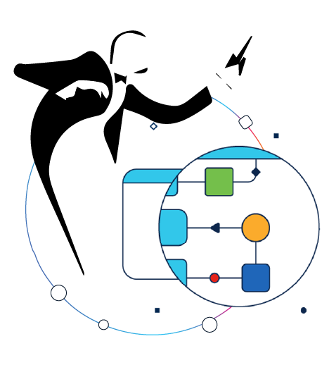

<h1 align="center">🚀 RADKit 🫰 AgenticOps  

</h1>

A collection of <strong>low-code</strong>, AgenticOps workflows based on <strong>n8n, MCP and Cisco RADKit</strong> for some nice Network Automation experiments 🧪
  

---

## 🚀 Overview

This repository showcases a series of **AI-powered low-code workflows** for interesting use cases that help you manage your Cisco RADKit network!  
**Stay tuned for periodic updates!** All the source code from the related episodes of the [🎥 Hack the RADKit! video series](https://www.youtube.com/playlist?list=PL2k86RlAekM8jm71nvG8aBffeZsew0hF5) is posted here.

---

## 🎯 What are we focusing on?

- **🧩 Low-Code Approach** - Build complex automation without extensive coding
- **🤝 Multi-Platform Support** - Works seamlessly across different platforms
- **⚡ Fast Deployment** - Import, configure, and run in minutes
- **🔐 Enterprise-Ready** - Built on proven Cisco RADKit infrastructure
- **🧠 AI-Native** - Leverages MCP (Model Context Protocol) for intelligent interactions

---

## ✅ Prerequisites

Before diving in, make sure you have these essentials ready:

- 🐳 **Docker** - For containerized workflow execution
- 🐍 **Python 3.10+** - Required for MCP server operations
- 🔧 **Active Cisco RADKit service** - Your network automation backbone
- 👤 **At least one remote user onboarded** - Pre-configured on your RADKit service

---

## 🚦 Getting Started

1. **Clone this repository** to your local machine
2. **Navigate to the `n8n` directory**
3. **Explore the workflow folders** - Each folder contains:
   - 📄 A `.json` workflow file ready to import into n8n
   - 📚 Dedicated documentation in `.md` files explaining setup and usage

Each workflow is self-contained with its own configuration and detailed instructions. Simply pick the one that fits your use case and follow along! 🎓

---

## 📦 Available Workflows

| Workflow Name | Description | Key Features |
|---------------|-------------|--------------|
| **[Multi-channel ChatOps for my RADKit Network workflow](https://github.com/ponchotitlan/radkit-loves-agenticops/tree/main/n8n/Multi-channel%20ChatOps%20for%20my%20RADKit%20Network%20workflow)** | Interact with your Cisco RADKit network through natural language conversations | 💬 Slack integration 🔷 Cisco Webex support 🤖 LLM-powered interactions 🔌 Direct MCP server connectivity |

---

## 🤝 Contributing

Got ideas for new workflows or improvements? Contributions are welcome! Feel free to open issues or submit pull requests.

---

## 🌐 Resources

- [Cisco RADKit Documentation](https://developer.cisco.com/)
- [n8n Documentation](https://docs.n8n.io/)
- [Model Context Protocol](https://modelcontextprotocol.io/)

---

 
    Made with ☕️ by Poncho Sandoval - <code>Developer Advocate 🥑 @ DevNet - Cisco Systems 🇵🇹</code>  
    
    
    

