# 🤖 Multi-Channel ChatOps for my Cisco RADKit network

A low-code n8n workflow that enables conversational AI interactions with Cisco RADKit network infrastructure across both Slack and Webex platforms, powered by your favourite LLM and the [Cisco RADKit Model Context Protocol (MCP) server](https://github.com/CiscoDevNet/radkit-mcp-server-community).

## 🎯 Overview

This workflow creates a unified AI assistant that:
- 💬 Responds to messages in both **Slack** and **Webex** channels
- 🧠 Uses **a LLM** with conversational memory
- 🔧 Connects to **Cisco RADKit** via MCP server for real-time network device queries
- 📡 Routes responses back to the appropriate platform automatically
- ✨ Formats responses with platform-appropriate markdown

</br>
<div align="center">
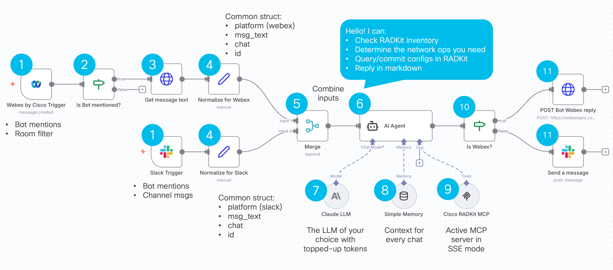
</div></br>

<div align="center">


</div>

## 🔑 Key Components

### **Trigger Nodes**

#### 1️⃣ Slack Trigger
- 📥 Listens for messages in configured Slack channels
- 🎯 Activates when bot is mentioned or message is posted
- 🔐 Uses Slack OAuth2 credentials

</br>
<div align="center">
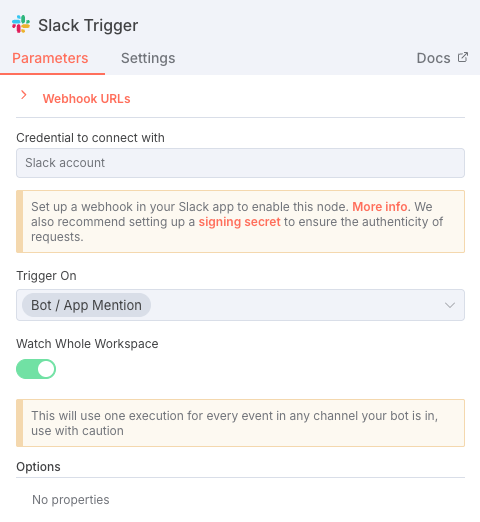
</div>

#### 1️⃣ 2️⃣ 3️⃣ Webex Trigger
- 📥 Listens for messages in specific Webex rooms (filtered by Room ID)
- 🤖 Filters for bot mentions using IF node
- 🔍 Fetches full message content via Webex API
- 🔐 Uses Webex OAuth2 credentials for listening

</br>
<div align="center">
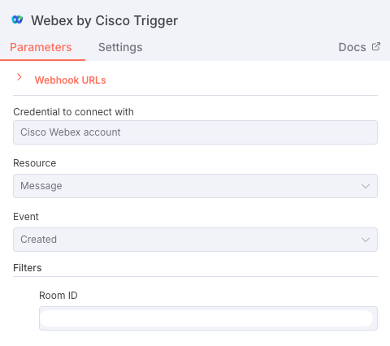</br>
</br>
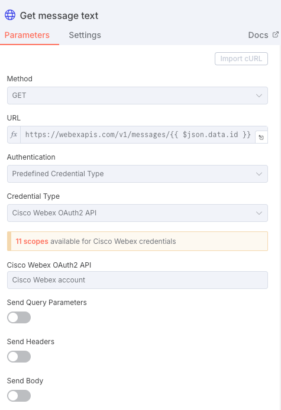
</div>

### **Normalization Layer**

**4️⃣ Edit Fields (Set) Nodes** - Transform platform-specific data into unified format:

```javascript
{
  platform: 'slack' | 'webex',
  message_text: 'User query text',
  chat: 'Platform-specific ID',
  id: 'For threading replies'
}
```

</br>
<div align="center">
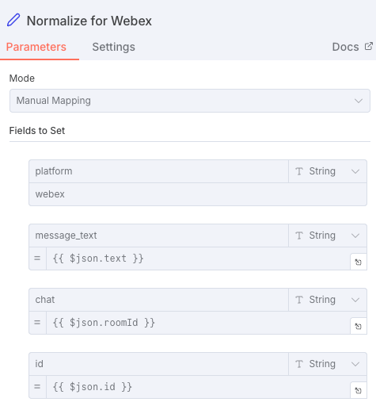</br>
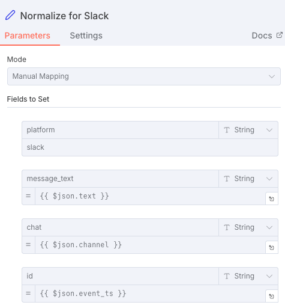
</div>
</br>

### **Merge Node**
5️⃣ Combines normalized data from both platforms into single stream

</br>
<div align="center">
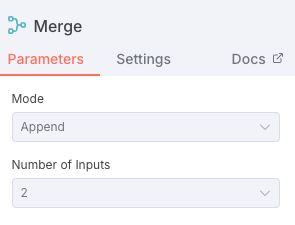
</div>

### **AI Processing Engine**

#### 6️⃣ AI Agent Node
- 🧠 **7️⃣ Model**: For the example, it is Claude Sonnet 4.5 (Anthropic)
- 💾 **8️⃣ Memory**: Window Buffer Memory (10 messages)
  - Session key: Channel/Room ID
  - Maintains conversation context per chat
- 🔧 **9️⃣ Tools**: MCP Server integration
  - Connects to the [Cisco RADKit MCP Server](https://github.com/CiscoDevNet/radkit-mcp-server-community)
  - Queries device attributes, configurations, status

</br>
<div align="center">
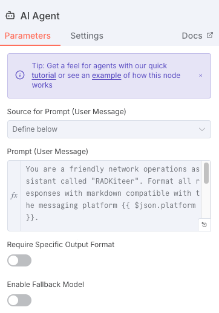
</div>
</br>

The `AI Agent block` prompt is the following:

```
You are a friendly network operations assistant called "RADKiteer". Format all responses with markdown compatible with the messaging platform {{ $json.platform }}.

- Use bold for emphasis
- Use backticks for device names, IPs, commands
- Use bullet points for lists
- Keep responses clear and scannable

Be helpful, professional, and conversational.

{{ $json.message_text }}
```

</br>
<div align="center">
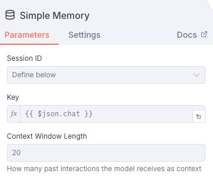</br>

</div>
</br>

> ⚠️ Notice the usage of the URL `http://host.docker.internal:8000/sse` in the MCP client block. This is because the MCP server is also running as a local Docker container on port 8000 with transport sse. Later on in the documentation it is shown how to deploy it.

### **Response Router**

#### 1️⃣0️⃣ IF Node (Platform Check)
- 🔀 Routes responses based on originating platform
- ✅ `True` → Slack path
- ❌ `False` → Webex path

</br>
<div align="center">
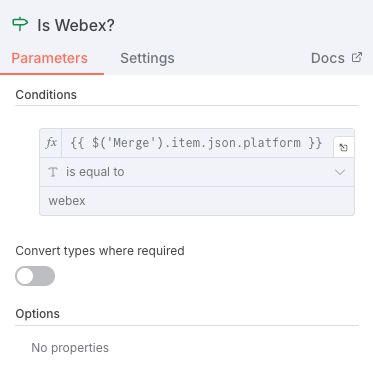
</div>
</br>

### **Reply Nodes**

#### 1️⃣1️⃣ Slack Reply
- 💬 Sends message to original Slack channel
- 🧵 Replies in thread using `channel`
- ✨ Supports Slack markdown formatting

</br>
<div align="center">
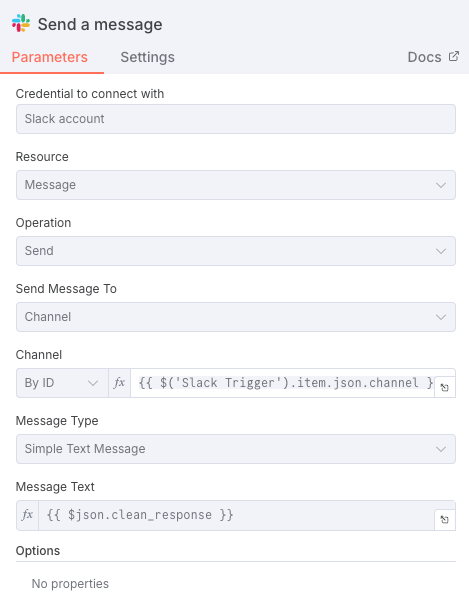
</div>
</br>

#### 1️⃣1️⃣ Webex Reply (HTTP Request)
- 💬 Sends message via Webex API
- 🤖 Uses **Bot Access Token** (replies as bot, not user)
- 🧵 Replies in thread using `parentId`
- ✨ Supports Webex markdown via `markdown` field

</br>
<div align="center">
</br>
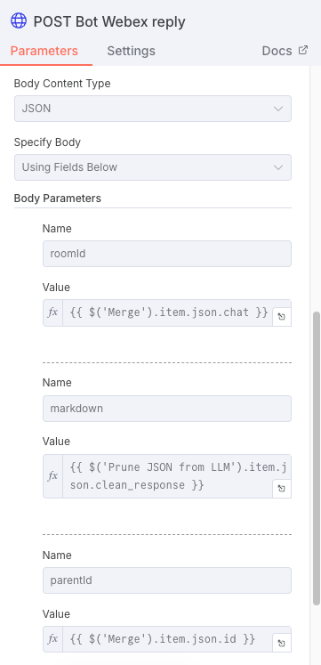
</div>
</br>

## 💬 Message Flow Example

```
User in Slack: "@RADKiteer please tell me which are the interfaces available on device p0-2e
      ↓
Slack Trigger captures message
      ↓
Edit Fields normalizes to standard format
      ↓
Merge combines with any Webex messages
      ↓
AI Agent:
  - Receives: "please tell me which are the interfaces available on device p0-2e"
  - Calls MCP Tool: get_device_attributes(target_device: "p0-2e")
  - Receives: {device_type: "Cisco IOS-XE", host: "10.48.180.61", ...}
  - Determines based on device_type the command for fetching all interfaces 
  - Calls MCP Tool: exec_cli_commands_in_device(cli_commands: "show ip interface brief",target_device: "p0-2e")
  - Receives: {Vlan1, Vlan1021, GigabitEthernet0/0, GigabitEthernet1/0/1 ...}
  - Generates response with markdown formatting
      ↓
Edit Fields cleans output
      ↓
IF node checks platform = 'slack'
      ↓
Slack Reply sends formatted response in thread
      ↓
User sees: "Based on the device information retrieved for p0-2e, here are the key details:
* Device Type: Cisco IOS-XE
* Interfaces:
  - Vlan1
  - Vlan1021
  . . .
```

<div align="center">
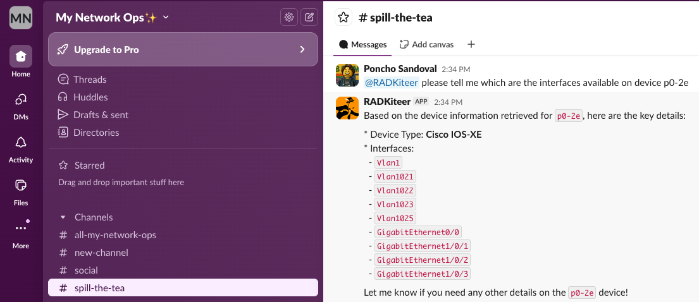
</div></br>

The same experience can be obtained using `Cisco Webex`:

<div align="center">

</div>

## 🛠️ Technical Details

<div align="center">
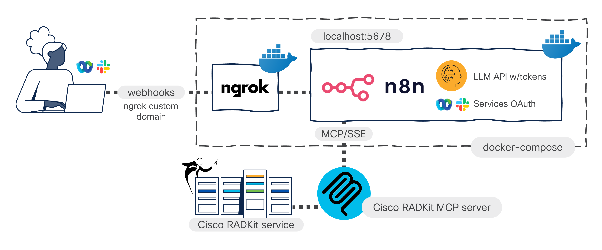
</div>

### Network Configuration
- 🌐 **Tunnel**: ngrok with custom domain
- 🔗 **Webhook URL**: `https://your-domain.ngrok-free.dev/`
- 🐳 **Deployment**: Docker Compose

### MCP Server Integration
- 🎯 **Server**: [Cisco RADKit MCP Server](https://github.com/CiscoDevNet/radkit-mcp-server-community)
- 🔌 **Connection**: Direct integration in AI Agent, `sse` transport
- 🛠️ **Capabilities**: 
  - Query device attributes
  - Retrieve configurations
  - Check device status
  - Network topology information

## 🔧 Setup

### Prerequisites
1. 🔑 LLM API key with topped-up balance
2. 🔧 Active Cisco RADKit service
3. 👤 At least one remote user onboarded on your RADKit service
4. 🌐 ngrok account (free tier works)

### Cisco RADKit SDK with MCP server
1. Git clone the project [radkit-mcp-server-community](https://github.com/CiscoDevNet/radkit-mcp-server-community)
2. Run the setup assistant in `https` transport mode
3. Activate the generated virtual environment with the following command:

```bash
source .venv/bin/activate
```

4. Run the MCP server with the following command:
```bash
python3 mcp_server.py 
```

You should see the following output:

```bash
2025-11-26 13:42:50,472 - __main__ - INFO - ✅ RADKit MCP Server running! (User radkit_chatops.gen@cisco.com for service XXXYYYYZZZZ)
2025-11-26 13:42:50,472 - __main__ - INFO - Starting MCP server with HTTPS transport on 0.0.0.0:8000


          ╭──────────────────────────────────────────────────────────────────────────────╮          
          │                                                                              │          
          │                         ▄▀▀ ▄▀█ █▀▀ ▀█▀ █▀▄▀█ █▀▀ █▀█                        │          
          │                         █▀  █▀█ ▄▄█  █  █ ▀ █ █▄▄ █▀▀                        │          
          │                                                                              │          
          │                                FastMCP 2.13.1                                │          
          │                                                                              │          
          │                                                                              │          
          │                   🖥  Server name: RADKitMCP                                 │          
          │                                                                              │          
          │                   📦 Transport:   SSE                                        │          
          │                   🔗 Server URL:  http://0.0.0.0:8000/sse                    │          
          │                                                                              │          
          │                   📚 Docs:        https://gofastmcp.com                      │          
          │                   🚀 Hosting:     https://fastmcp.cloud                      │          
          │                                                                              │          
          ╰──────────────────────────────────────────────────────────────────────────────╯          


[11/26/25 13:42:50] INFO     Starting MCP server 'RADKitMCP' with transport 'sse' on  server.py:2055
                             http://0.0.0.0:8000/sse                                                
INFO:     Started server process [78906]
INFO:     Waiting for application startup.
INFO:     Application startup complete.
INFO:     Uvicorn running on http://0.0.0.0:8000 (Press CTRL+C to quit)
```

### `docker-compose.yml` file setup

1. Replace the following fields of the `docker-compose.yml` file of this repository with your values:
```bash
- YOUR-STATIC-DOMAIN (Get it at https://dashboard.ngrok.com/cloud-edge/domains)
- YOUR_NGROK_TOKEN (Get it at https://dashboard.ngrok.com/get-started/your-authtoken)
- TZ=<your timezone code>
- GENERIC_TIMEZONE=<your timezone>
```

2. Run the docker-compose services
```bash
docker compose up -d
```

3. The following containers should be up and running:
```bash
% docker ps
CONTAINER ID   IMAGE                COMMAND                  CREATED          STATUS                    PORTS                    NAMES
4d70e20c29b4   ngrok/ngrok:latest   "/nix/store/1qpvcjc0…"   57 minutes ago   Up 57 minutes             0.0.0.0:4040->4040/tcp   ngrok
b47c77659c82   n8nio/n8n:latest     "tini -- /docker-ent…"   57 minutes ago   Up 57 minutes (healthy)   0.0.0.0:5678->5678/tcp   n8n
```

### n8n setup

1. Navigate to your n8n instance on a web browser in the address `127.0.0.1:5678`
2. Import the `.json` file included in this repository

### Slack Setup
✅💬 See [this frustration-free guide!](https://github.com/ponchotitlan/radkit-loves-agenticops/blob/main/n8n/Multi-channel%20ChatOps%20for%20my%20RADKit%20Network%20workflow/slack_setup.md)

### Webex Setup
✅💬 See [this frustration-free guide!](https://github.com/ponchotitlan/radkit-loves-agenticops/blob/main/n8n/Multi-channel%20ChatOps%20for%20my%20RADKit%20Network%20workflow/cisco_webex_setup.md)

## 📊 Performance Considerations

- ⚡ **Trigger Efficiency**: Webex filtered by room ID, minimal unnecessary activations
- 🔍 **Smart Filtering**: Bot mention check happens before expensive API calls
- 💾 **Memory Management**: Window buffer limited to 10 messages per session
- 🚀 **Parallel Processing**: Both platforms can trigger simultaneously
- 📉 **Token Usage**: Only mentioned messages invoke AI/MCP tools

## 🐛 Troubleshooting

### Webhook Not Triggering
```bash
# Check ngrok tunnel
curl -I https://your-domain.ngrok-free.dev/

# Check n8n logs
docker-compose logs n8n | grep -i "webhook\|error"
```

### Bot Not Replying
- ✅ Verify workflow is **Active**
- ✅ Check bot is member of room/channel
- ✅ Verify credentials are valid
- ✅ Check Executions tab for errors

### Webex Replies as User Instead of Bot
- ⚠️ Make sure Webex reply uses **Bot Access Token**, not OAuth2

### Permission Errors
- 🔒 Ensure `N8N_USER_MANAGEMENT_DISABLED=true` in docker-compose

## 📝 License & Credits

Built with:
- [n8n](https://n8n.io) - Workflow automation
- [Anthropic Claude](https://anthropic.com) - AI model
- [radkit-mcp-server-community](https://github.com/CiscoDevNet/radkit-mcp-server-community) - Cisco RADKit MCP Server
- [Cisco RADKit SDK](https://developer.cisco.com) - Network automation
- [ngrok](https://ngrok.com) - Secure tunneling

> ✅ Check the video [🎥 Hack the RADKit! Chatting with My Network via FastMCP](https://www.youtube.com/watch?v=lsj05owx2Q0) for more information about the [radkit-mcp-server-community](https://github.com/CiscoDevNet/radkit-mcp-server-community) Cisco RADKit MCP Server!

---

<div align="center"><br />
    Made with ☕️ by Poncho Sandoval - <code>Developer Advocate 🥑 @ DevNet - Cisco Systems 🇵🇹</code>
</div>