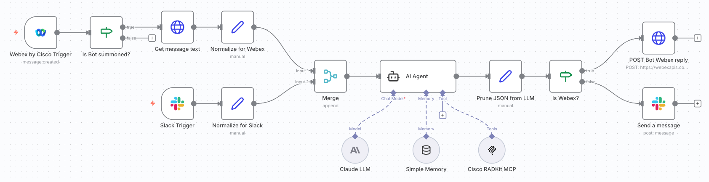

# 🤖 Multi-Channel ChatOps for my Cisco RADKit network

A low-code n8n workflow that enables conversational AI interactions with Cisco RADKit network infrastructure across both Slack and Webex platforms, powered by Claude AI and the Cisco RADKit Model Context Protocol (MCP) server.

## 🎯 Overview

This workflow creates a unified AI assistant that:
- 💬 Responds to messages in both **Slack** and **Webex** channels
- 🧠 Uses **Claude AI** with conversational memory
- 🔧 Connects to **Cisco RADKit** via MCP server for real-time network device queries
- 📡 Routes responses back to the appropriate platform automatically
- ✨ Formats responses with platform-appropriate markdown

<div align="center">

</div>

## 🏗️ Architecture

```
┌─────────────────┐         ┌──────────────────┐
│  Slack Trigger  │         │  Webex Trigger   │
│                 │         │                  │
│ - Bot mentions  │         │ - Room filter    │
│ - Channel msgs  │         │ - Bot mentions   │
└────────┬────────┘         └────────┬─────────┘
         │                           │
         │                           ├─► IF: Bot Mentioned?
         │                           │
         │                           ├─► HTTP Request: Fetch Message
         │                           │
         ├───────────┬───────────────┤
         │           │               │
    ┌────▼───────────▼────┐    ┌────▼──────────┐
    │  Edit Fields (Set)  │    │ Edit Fields   │
    │                     │    │   (Webex)     │
    │  Normalize Slack    │    │               │
    └──────────┬──────────┘    └───────┬───────┘
               │                       │
               └───────────┬───────────┘
                           │
                    ┌──────▼──────┐
                    │    Merge    │
                    │             │
                    │ Combines    │
                    │ both inputs │
                    └──────┬──────┘
                           │
                    ┌──────▼──────┐
                    │  AI Agent   │
                    │             │
                    │ - Claude AI │
                    │ - MCP Tools │
                    │ - Memory    │
                    └──────┬──────┘
                           │
                    ┌──────▼──────────┐
                    │  Edit Fields    │
                    │                 │
                    │ Clean AI output │
                    └──────┬──────────┘
                           │
                    ┌──────▼──────┐
                    │ IF: Platform │
                    │   Check      │
                    └──┬────────┬──┘
                       │        │
            ┌──────────▼┐      └──────────┐
            │   Slack   │                 │
            │   Reply   │            ┌────▼────────┐
            │           │            │ HTTP Request│
            │ - Thread  │            │             │
            │ - Format  │            │ Webex Reply │
            └───────────┘            │ (as Bot)    │
                                     └─────────────┘
```

## 🔑 Key Components

### 1️⃣ **Trigger Nodes**

#### Slack Trigger
- 📥 Listens for messages in configured Slack channels
- 🎯 Activates when bot is mentioned or message is posted
- 🔐 Uses Slack OAuth2 credentials

#### Webex Trigger
- 📥 Listens for messages in specific Webex rooms (filtered by Room ID)
- 🤖 Filters for bot mentions using IF node
- 🔍 Fetches full message content via Webex API
- 🔐 Uses Webex OAuth2 credentials for listening

### 2️⃣ **Normalization Layer**

**Edit Fields (Set) Nodes** - Transform platform-specific data into unified format:

```javascript
{
  platform: 'slack' | 'webex',
  message_text: 'User query text',
  channel_or_room: 'Platform-specific ID',
  thread_or_message_id: 'For threading replies',
  person_email: 'Webex only'
}
```

**Merge Node** - Combines normalized data from both platforms into single stream

### 3️⃣ **AI Processing Engine**

#### AI Agent Node
- 🧠 **Model**: Claude Sonnet 4.5 (Anthropic)
- 💾 **Memory**: Window Buffer Memory (10 messages)
  - Session key: Channel/Room ID
  - Maintains conversation context per chat
- 🔧 **Tools**: MCP Server integration
  - Connects to the [Cisco RADKit SDK](https://github.com/CiscoDevNet/radkit-mcp-server-community)
  - Queries device attributes, configurations, status
- 📝 **System Prompt**: Configured with markdown formatting guidelines

#### Edit Fields (Clean Response)
- ✂️ Extracts clean AI response from execution metadata
- 🧹 Removes tool usage details
- 📤 Prepares formatted text for sending

### 4️⃣ **Response Router**

#### IF Node (Platform Check)
- 🔀 Routes responses based on originating platform
- ✅ `True` → Slack path
- ❌ `False` → Webex path

### 5️⃣ **Reply Nodes**

#### Slack Reply
- 💬 Sends message to original Slack channel
- 🧵 Replies in thread using `thread_ts`
- ✨ Supports Slack markdown formatting

#### Webex Reply (HTTP Request)
- 💬 Sends message via Webex API
- 🤖 Uses **Bot Access Token** (replies as bot, not user)
- 🧵 Replies in thread using `parentId`
- ✨ Supports Webex markdown via `markdown` field

## 🛠️ Technical Details

### Network Configuration
- 🌐 **Tunnel**: ngrok with static domain
- 🔗 **Webhook URL**: `https://your-domain.ngrok-free.dev/`
- 🐳 **Deployment**: Docker Compose
- ⚙️ **Environment**: 
  - `WEBHOOK_URL` - Public ngrok URL
  - `N8N_USER_MANAGEMENT_DISABLED=true` - Fixes webhook permissions
  - `TZ=Europe/Lisbon` - Timezone configuration

### Authentication
| Platform | Trigger Auth | Reply Auth | Notes |
|----------|-------------|------------|-------|
| **Slack** | OAuth2 | OAuth2 | Same credential for both |
| **Webex** | OAuth2 (Integration) | Bot Access Token | Different credentials! |

### MCP Server Integration
- 🎯 **Server**: [Cisco RADKit SDK](https://github.com/CiscoDevNet/radkit-mcp-server-community)
- 🔌 **Connection**: Direct integration in AI Agent, `sse` transport
- 🛠️ **Capabilities**: 
  - Query device attributes
  - Retrieve configurations
  - Check device status
  - Network topology information

### Message Flow Example

```
User in Slack: "@bot what is the device type of ksp-g02-asr9010-01?"
      ↓
Slack Trigger captures message
      ↓
Edit Fields normalizes to standard format
      ↓
Merge combines with any Webex messages
      ↓
AI Agent:
  - Receives: "what is the device type of ksp-g02-asr9010-01?"
  - Calls MCP Tool: get_device_attributes("ksp-g02-asr9010-01")
  - Receives: {device_type: "ASR9010", host: "10.48.180.61", ...}
  - Generates response with markdown formatting
      ↓
Edit Fields cleans output
      ↓
IF node checks platform = 'slack'
      ↓
Slack Reply sends formatted response in thread
      ↓
User sees: "The device ksp-g02-asr9010-01 is an *ASR9010*..."
```

## 🎨 Features

### ✅ Implemented
- ✨ Multi-platform support (Slack + Webex)
- 🧠 Conversational AI with memory
- 🔧 Network device queries via MCP
- 🧵 Threaded replies
- 📝 Markdown formatting
- 🔄 Automatic platform routing
- 🤖 Bot identity for Webex replies
- 🎯 Mention-based activation
- 📊 Room/channel filtering

## 🔧 Configuration Requirements

### Prerequisites
1. ☁️ n8n instance (self-hosted or cloud)
2. 🔑 Anthropic API key (for Claude)
3. 🎮 Cisco RADKit SDK with MCP server
4. 💬 Slack workspace with bot app
5. 💬 Webex workspace with bot
6. 🌐 ngrok account (free tier works)

### Cisco RADKit SDK with MCP server
1. Git clone the project [radkit-mcp-server-community](https://github.com/CiscoDevNet/radkit-mcp-server-community)
2. Run the setup assistant in `https` transport mode
3. Activate the generated virtual environment with the following command:

```bash
source .venv/bin/activate
```

4. Run the MCP server with the following command:
```bash
python3 mcp_server.py 
```

You should see the following output:

```bash
2025-11-26 13:42:50,472 - __main__ - INFO - ✅ RADKit MCP Server running! (User radkit_chatops.gen@cisco.com for service XXXYYYYZZZZ)
2025-11-26 13:42:50,472 - __main__ - INFO - Starting MCP server with HTTPS transport on 0.0.0.0:8000


          ╭──────────────────────────────────────────────────────────────────────────────╮          
          │                                                                              │          
          │                         ▄▀▀ ▄▀█ █▀▀ ▀█▀ █▀▄▀█ █▀▀ █▀█                        │          
          │                         █▀  █▀█ ▄▄█  █  █ ▀ █ █▄▄ █▀▀                        │          
          │                                                                              │          
          │                                FastMCP 2.13.1                                │          
          │                                                                              │          
          │                                                                              │          
          │                   🖥  Server name: RADKitMCP                                 │          
          │                                                                              │          
          │                   📦 Transport:   SSE                                        │          
          │                   🔗 Server URL:  http://0.0.0.0:8000/sse                    │          
          │                                                                              │          
          │                   📚 Docs:        https://gofastmcp.com                      │          
          │                   🚀 Hosting:     https://fastmcp.cloud                      │          
          │                                                                              │          
          ╰──────────────────────────────────────────────────────────────────────────────╯          


[11/26/25 13:42:50] INFO     Starting MCP server 'RADKitMCP' with transport 'sse' on  server.py:2055
                             http://0.0.0.0:8000/sse                                                
INFO:     Started server process [78906]
INFO:     Waiting for application startup.
INFO:     Application startup complete.
INFO:     Uvicorn running on http://0.0.0.0:8000 (Press CTRL+C to quit)
```

### `docker-compose.yml` file setup

1. Replace the following fields of the `docker-compose.yml` file of this repository with your values:
```bash
WEBHOOK_URL=https://your-domain.ngrok-free.dev/
TZ=<your-timezone>
GENERIC_TIMEZONE=<your-timezone>
```

2. Run the docker-compose services
```bash
docker compose up -d
```

3. The following containers should be up and running:
```bash
% docker ps
CONTAINER ID   IMAGE                COMMAND                  CREATED          STATUS                    PORTS                    NAMES
4d70e20c29b4   ngrok/ngrok:latest   "/nix/store/1qpvcjc0…"   57 minutes ago   Up 57 minutes             0.0.0.0:4040->4040/tcp   ngrok
b47c77659c82   n8nio/n8n:latest     "tini -- /docker-ent…"   57 minutes ago   Up 57 minutes (healthy)   0.0.0.0:5678->5678/tcp   n8n
```

### Slack Setup
1. Create a Workspace in your Slack
2. Create Slack App at api.slack.com/apps
3. Add Bot Token Scopes:
   - `channels:history`
   - `chat:write`
   - `groups:history`
   - `im:history`
   - `mpim:history`
4. Enable Event Subscriptions with the URL provided by n8n in the Slack trigger node
5. Subscribe to bot events: `message.channels`, `app_mention`
6. Install app to workspace
7. Copy Bot User OAuth Token to n8n

### Webex Setup
**Integration (for receiving messages):**
1. Create Integration at developer.webex.com
2. Set Redirect URI: `https://your-domain.ngrok-free.dev/rest/oauth2-credential/callback`
3. Add scopes:
   - `spark:rooms_read`
   - `spark:messages_read`
   - `spark:memberships_read`
4. Copy Client ID & Secret to n8n

**Bot (for sending replies):**
1. Create Bot at developer.webex.com
2. Copy Bot Access Token
3. Use in HTTP Request node for replies

## 📊 Performance Considerations

- ⚡ **Trigger Efficiency**: Webex filtered by room ID, minimal unnecessary activations
- 🔍 **Smart Filtering**: Bot mention check happens before expensive API calls
- 💾 **Memory Management**: Window buffer limited to 10 messages per session
- 🚀 **Parallel Processing**: Both platforms can trigger simultaneously
- 📉 **Token Usage**: Only mentioned messages invoke AI/MCP tools

## 🐛 Troubleshooting

### Webhook Not Triggering
```bash
# Check ngrok tunnel
curl -I https://your-domain.ngrok-free.dev/

# Check n8n logs
docker-compose logs n8n | grep -i "webhook\|error"
```

### Bot Not Replying
- ✅ Verify workflow is **Active**
- ✅ Check bot is member of room/channel
- ✅ Verify credentials are valid
- ✅ Check Executions tab for errors

### Webex Replies as User Instead of Bot
- ⚠️ Make sure Webex reply uses **Bot Access Token**, not OAuth2

### Permission Errors
- 🔒 Ensure `N8N_USER_MANAGEMENT_DISABLED=true` in docker-compose

## 📝 License & Credits

Built with:
- [n8n](https://n8n.io) - Workflow automation
- [Anthropic Claude](https://anthropic.com) - AI model
- [radkit-mcp-server-community](https://github.com/CiscoDevNet/radkit-mcp-server-community) - Cisco RADKit MCP Server
- [Cisco RADKit SDK](https://developer.cisco.com) - Network automation
- [ngrok](https://ngrok.com) - Secure tunneling

> ⚠️ Check the video [🎥 Hack the RADKit! Chatting with My Network via FastMCP](https://www.youtube.com/watch?v=lsj05owx2Q0) for more information about the [radkit-mcp-server-community](https://github.com/CiscoDevNet/radkit-mcp-server-community) Cisco RADKit MCP Server!

---

<div align="center"><br />
    Made with ☕️ by Poncho Sandoval - <code>Developer Advocate 🥑 @ DevNet - Cisco Systems 🇵🇹</code>
</div>