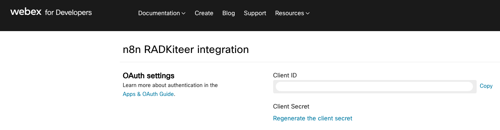
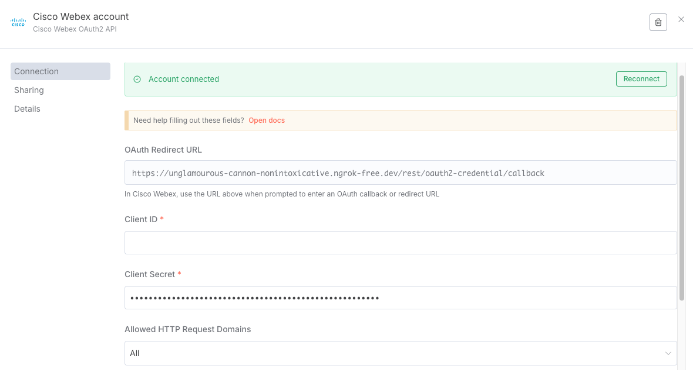
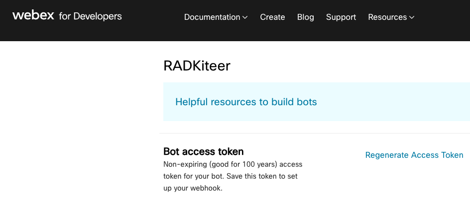
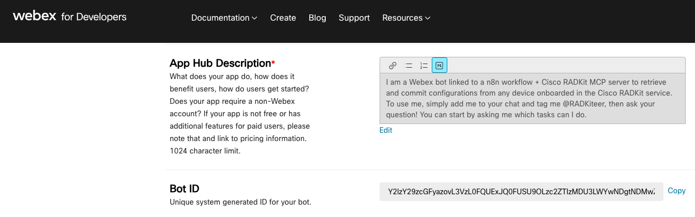
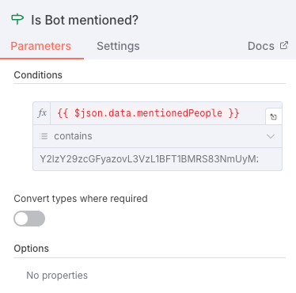
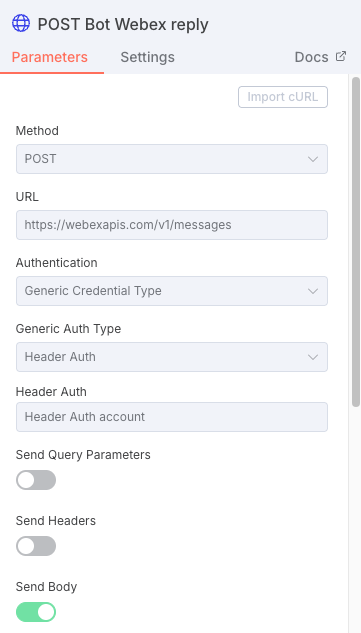
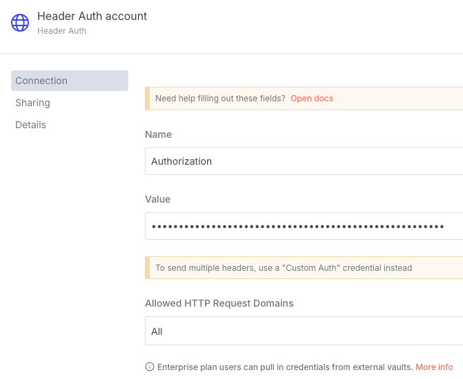
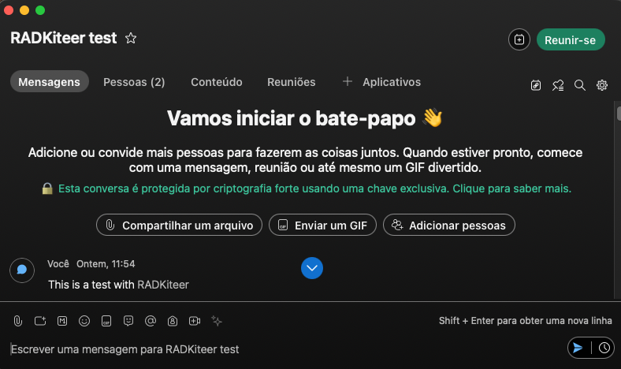
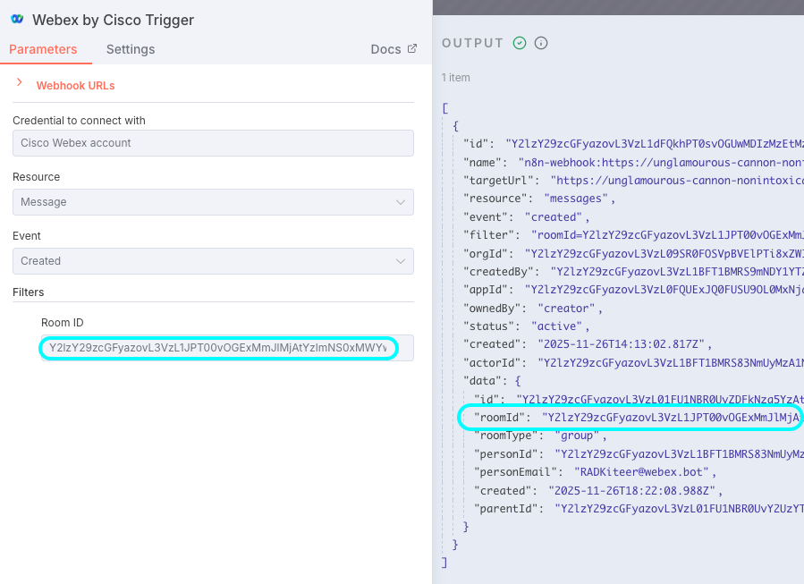
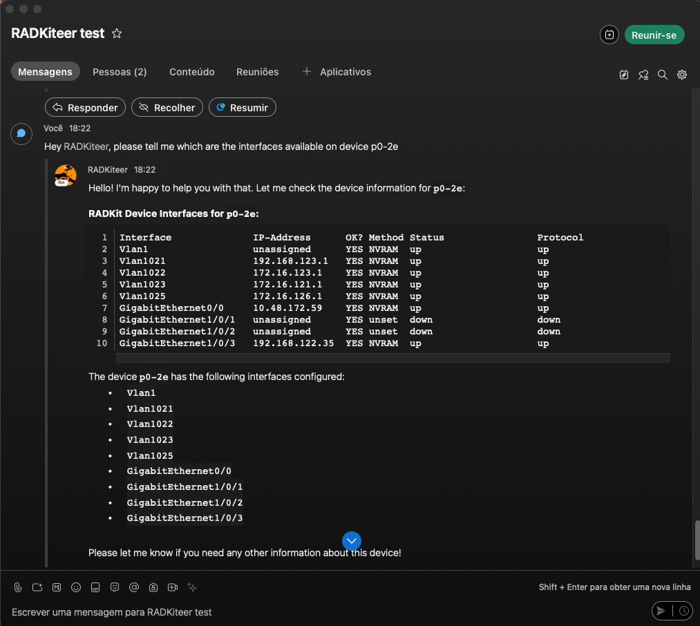

# ⚙️ Webex setup for n8n workflows

This document describes how to setup your Webex system for interacting with the Multi-Channel ChatOps n8n workflow in this repository. 
**Buckle up!**

## 🔌 Integration (for receiving messages)
1. Navigate to `https://developer.webex.com/my-apps`. Click on `Create a New App` and select `Integration`
2. Set Redirect URI: `https://your-domain.ngrok-free.dev/rest/oauth2-credential/callback`
3. Add scopes:
   - `spark:rooms_read`
   - `spark:messages_read`
   - `spark:memberships_read`
4. Take note of the `Client ID` & `Client Secret`

 

 

5. in your n8n workflow, open your `Webex by Cisco Trigger`. Navigate to `Credential to connect with` and add a new credential. Provide the `Client ID` & `Client Secret` from the previous step

 

 

## 🤖 Bot (for filtering messages and sending replies)
1. Navigate to `https://developer.webex.com/my-apps`. Click on `Create a New App` and select `Bot`
2. Take note of the `Bot access token`

 

 

3. Also take note of the `Bot ID`

 

 

4. Back in your n8n workflow, open your `If block "Is Bot mentioned?"` and add a `Contains` condition where you check if the incoming request has the `Bot ID` fetched in the previous step

 

 

5. Navigate to the `POST - Bot Webex Reply` block in your n8n workflow. In the `Generic Auth Type` option, select `Header Auth`. Create a new `Header Auth` credential with the following parameters: 
- `Name`: `Authorization`
- `Value`: `Bearer <Bot access token from step no.2>`

 

 

 

 

## 🚪 Room (for limiting the checking of messages just to this specific room)

> This is more like a quick hack. You can get the Room ID via the Webex API, but this is way faster!

1. Set your n8n workflow to Test mode, and activate testing in your `Webex by Cisco Trigger` block
2. Open your Cisco Webex app. Create a new room
3. Send any given random message in this room

 

 

4. Go back to your n8n workflow. Open your `Webex by Cisco Trigger` block, and take note of the parameter `data.roomId` in the input parameters
5. Copy that ID into the `Filters` > `Room ID` parameter of your block

 

 

---

**That's it!** To test, simply add your bot to the room that you created, tag it and ask any question related to your Cisco RADKit network!

 

 