# 🤖 Multi-Channel ChatOps for my Cisco RADKit network

A low-code n8n workflow that enables conversational AI interactions with Cisco RADKit network infrastructure across both Slack and Webex platforms, powered by your favourite LLM and the Cisco RADKit MCP server.

## 🎯 Overview

This workflow creates a unified AI assistant that:
- 💬 Responds to messages in both **Slack** and **Webex** channels
- 🧠 Uses **a LLM** with conversational memory
- 🔧 Connects to **Cisco RADKit** via MCP server for real-time network device queries
- 📡 Routes responses back to the appropriate platform automatically
- ✨ Formats responses with platform-appropriate markdown

</br>
<div align="center">
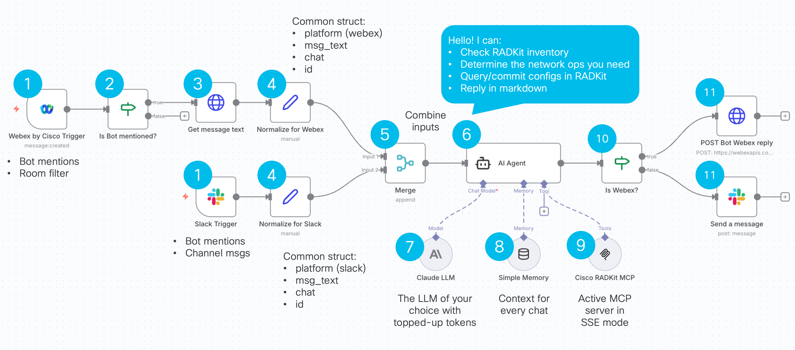
</div></br>

<div align="center">


</div></br>
<div align="center">
<a href="https://www.youtube.com/watch?v=8rE-WYWWIoE">
  
</a>
</div>

## 🛠️ Setup

This workflow uses a **Cloudflare tunnel + domain** for the Webex/Slack webhooks, plus an instance of the **official RADKit MCP server**. To set this up, check [this guide](https://github.com/ponchotitlan/radkit-loves-agenticops/blob/main/docs/HOWTO-RADKIT-MCP.md#-docker-based-deployment-of-the-mcp-server).

### n8n workflow import
1. Navigate to your n8n instance on a web browser
2. Create a new workflow
3. Import the file [Multi-Channel ChatOps for my Cisco RADKit network.json](Multi-Channel%20ChatOps%20for%20my%20Cisco%20RADKit%20network.json) included in this repository

### Slack Setup
✅💬 See [this frustration-free guide!](../../docs/SLACK-SETUP.md)

### Webex Setup
✅💬 See [this frustration-free guide!](../../docs/WEBEX-SETUP.md)


## 🔑 Key Components

### **Trigger Nodes**

#### 1️⃣ Slack Trigger
- 📥 Listens for messages in configured Slack channels
- 🎯 Activates when bot is mentioned or message is posted
- 🔐 Uses Slack OAuth2 credentials

</br>
<div align="center">
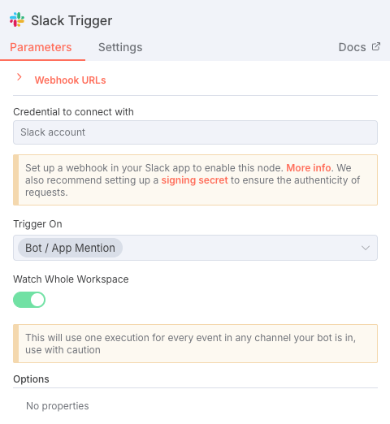
</div>

#### 1️⃣ 2️⃣ 3️⃣ Webex Trigger
- 📥 Listens for messages in specific Webex rooms (filtered by Room ID)
- 🤖 Filters for bot mentions using IF node
- 🔍 Fetches full message content via Webex API
- 🔐 Uses Webex OAuth2 credentials for listening

</br>
<div align="center">
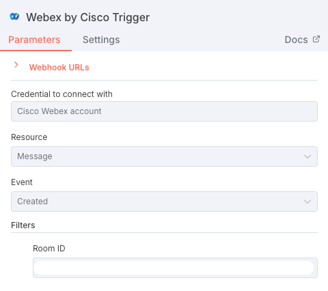</br>
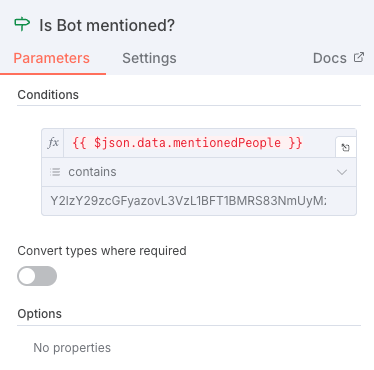</br>
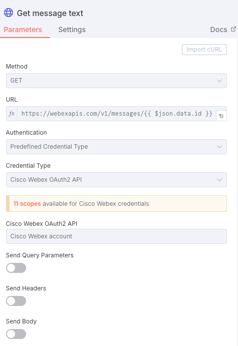
</div>

### **Normalization Layer**

**4️⃣ Edit Fields (Set) Nodes** - Transform platform-specific data into unified format:

```javascript
{
  platform: 'slack' | 'webex',
  message_text: 'User query text',
  chat: 'Platform-specific ID',
  id: 'For threading replies'
}
```

</br>
<div align="center">
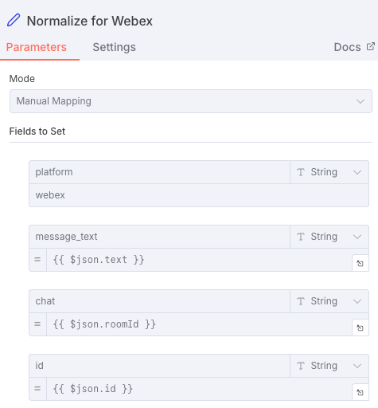</br>
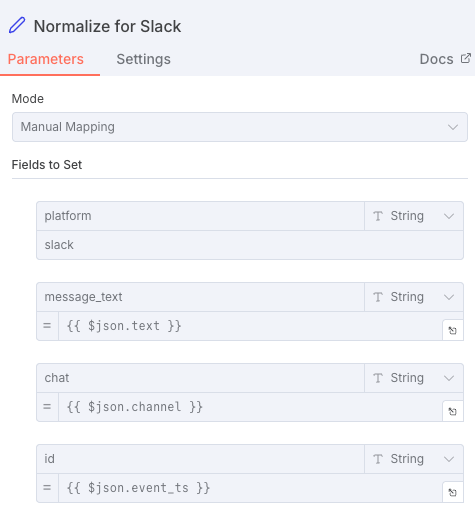
</div>
</br>

### **Merge Node**
5️⃣ Combines normalized data from both platforms into single stream

</br>
<div align="center">
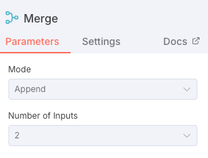
</div>

### **AI Processing Engine**

#### 6️⃣ AI Agent Node
- 🧠 **7️⃣ Model**: For the example, it is Claude Sonnet 4.5 (Anthropic)
- 💾 **8️⃣ Memory**: Window Buffer Memory (10 messages)
  - Session key: Channel/Room ID
  - Maintains conversation context per chat
- 🔧 **9️⃣ Tools**: MCP Server integration
  - Connects to the [Cisco RADKit MCP Server](https://github.com/CiscoDevNet/radkit-mcp-server-community)
  - Queries device attributes, configurations, status

</br>
<div align="center">
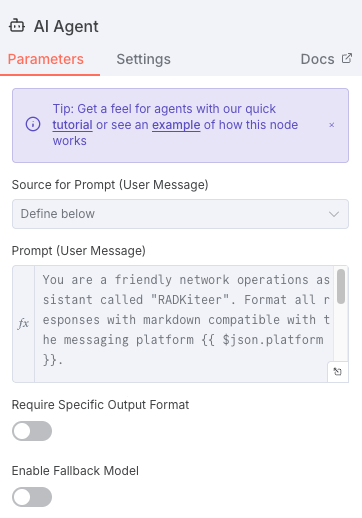
</div>
</br>

The `AI Agent block` prompt is the following:

```
You are a friendly network operations assistant called "RADKiteer". Format all responses with markdown compatible with the messaging platform {{ $json.platform }}.

- Use bold for emphasis
- Use backticks for device names, IPs, commands
- Use bullet points for lists
- Keep responses clear and scannable

Be helpful, professional, and conversational.

{{ $json.message_text }}
```

</br>
<div align="center">
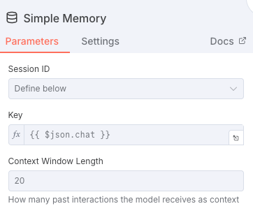</br>
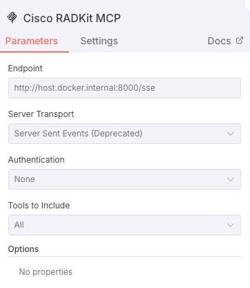
</div>
</br>

> ⚠️ Notice the usage of the URL `http://host.docker.internal:8000/sse` in the MCP client block. This is because the MCP server is also running as a local Docker container on port 8000 with transport sse. Later on in the documentation it is shown how to deploy it.

### **Response Router**

#### 1️⃣0️⃣ IF Node (Platform Check)
- 🔀 Routes responses based on originating platform
- ✅ `True` → Slack path
- ❌ `False` → Webex path

</br>
<div align="center">
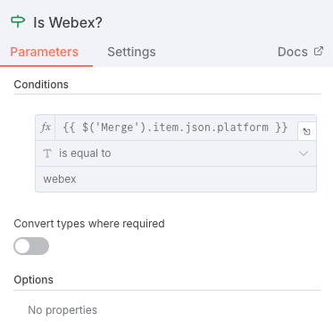
</div>
</br>

### **Reply Nodes**

#### 1️⃣1️⃣ Slack Reply
- 💬 Sends message to original Slack channel
- 🧵 Replies in thread using `channel`
- ✨ Supports Slack markdown formatting

</br>
<div align="center">
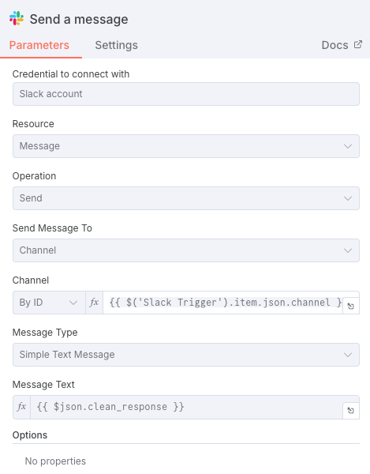
</div>
</br>

#### 1️⃣1️⃣ Webex Reply (HTTP Request)
- 💬 Sends message via Webex API
- 🤖 Uses **Bot Access Token** (replies as bot, not user)
- 🧵 Replies in thread using `parentId`
- ✨ Supports Webex markdown via `markdown` field

</br>
<div align="center">
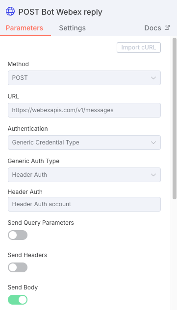</br>
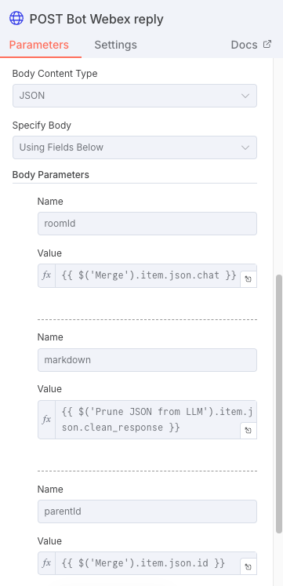
</div>
</br>

## 💬 Message Flow Example

```
User in Slack: "@RADKiteer please tell me which are the interfaces available on device p0-2e
      ↓
Slack Trigger captures message
      ↓
Edit Fields normalizes to standard format
      ↓
Merge combines with any Webex messages
      ↓
AI Agent:
  - Receives: "please tell me which are the interfaces available on device p0-2e"
  - Calls MCP Tool: get_device_attributes(target_device: "p0-2e")
  - Receives: {device_type: "Cisco IOS-XE", host: "10.48.180.61", ...}
  - Determines based on device_type the command for fetching all interfaces 
  - Calls MCP Tool: exec_cli_commands_in_device(cli_commands: "show ip interface brief",target_device: "p0-2e")
  - Receives: {Vlan1, Vlan1021, GigabitEthernet0/0, GigabitEthernet1/0/1 ...}
  - Generates response with markdown formatting
      ↓
Edit Fields cleans output
      ↓
IF node checks platform = 'slack'
      ↓
Slack Reply sends formatted response in thread
      ↓
User sees: "Based on the device information retrieved for p0-2e, here are the key details:
* Device Type: Cisco IOS-XE
* Interfaces:
  - Vlan1
  - Vlan1021
  . . .
```

<div align="center">
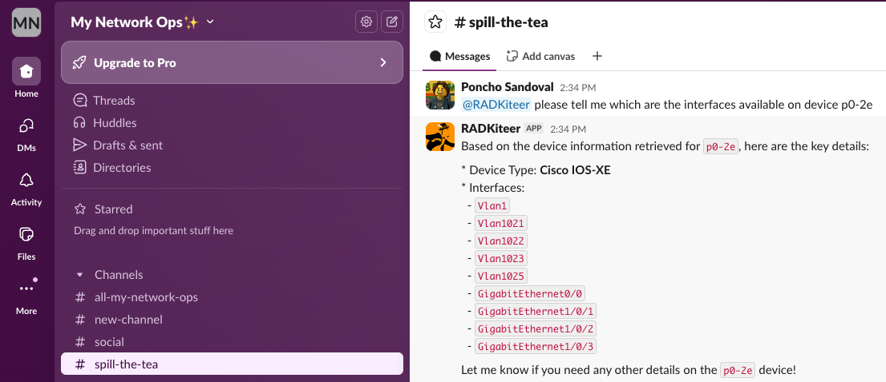
</div></br>

The same experience can be obtained using `Cisco Webex`:

<div align="center">
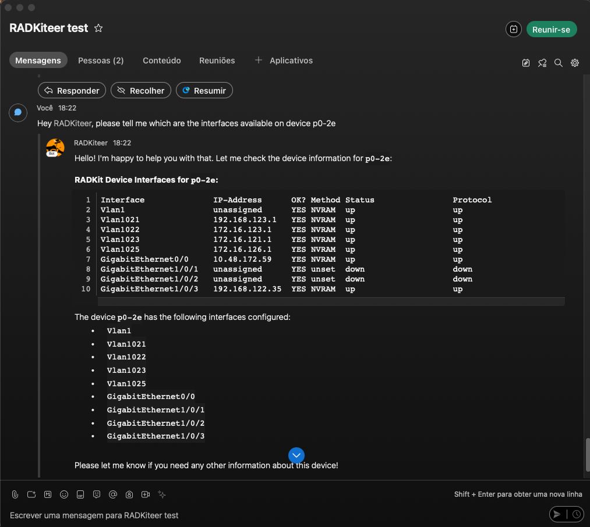
</div>

---

<div align="center"><br />
    Made with ☕️ by Poncho Sandoval - <code>Developer Advocate 🥑 @ DevNet - Cisco Systems 🇵🇹</code>
</div>